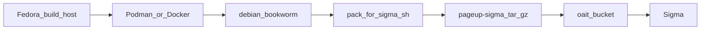
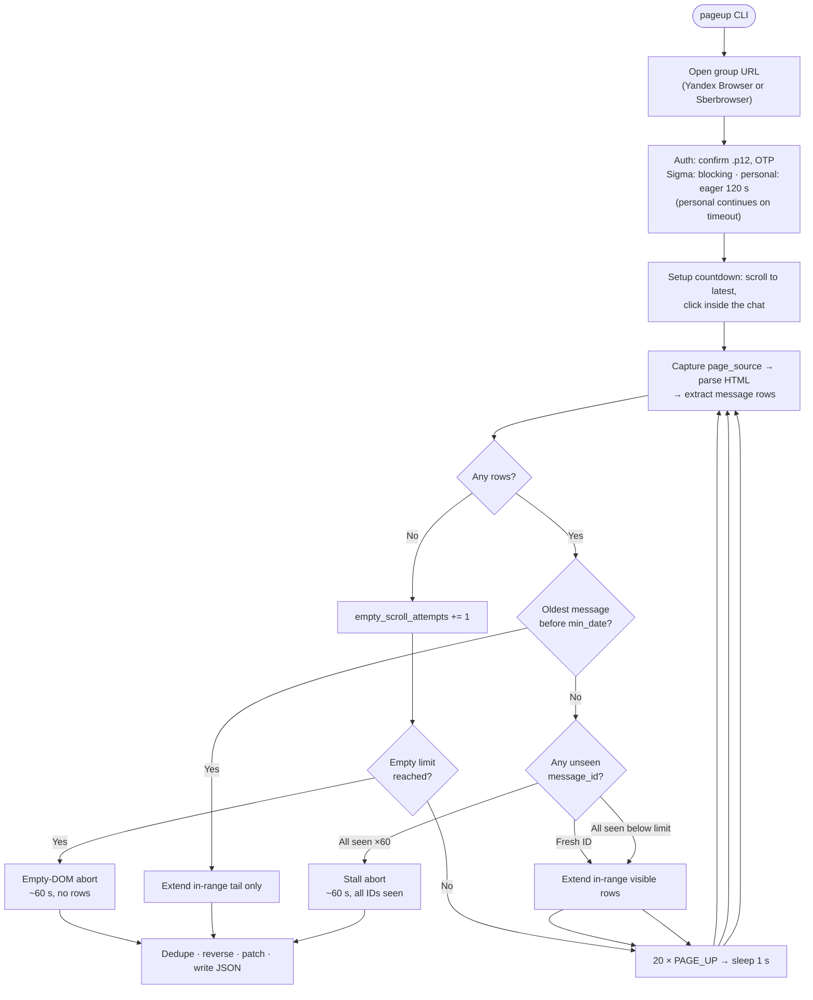

<!-- pageup README — explicit <a id> anchors for TOC; section headers use · [↑](#toc). -->

<p align="center">
  
</p>

<h1 align="center">pageup</h1>

<p align="center">
  Collect messages from a SberChat group chat into structured JSON.
</p>

<p align="center">
  
  
  
  
  
</p>

---

<a id="toc"></a>

## Table of contents

- [Overview](#overview)
- [Design rationale](#design-rationale)
- [Sigma integration context](#sigma-integration-context)
- [Build artefacts in `dist/`](#build-artefacts-in-dist)
- [Architecture & data flow](#architecture--data-flow)
- [Requirements](#requirements)
- [End-to-end walkthrough](#end-to-end-walkthrough)
  - [Phase 1 — Fedora setup](#phase-1--fedora-setup)
  - [Phase 2 — Build for Sigma](#phase-2--build-for-sigma)
  - [Phase 3 — Deploy to Sigma](#phase-3--deploy-to-sigma)
  - [Phase 4 — Run on Sigma](#phase-4--run-on-sigma)
  - [Phase 4 (alt) — Run on Fedora](#phase-4-alt--run-on-fedora)
  - [Sigma quick start (RU)](#sigma-quick-start-ru)
- [CLI reference](#cli-reference)
- [Output format](#output-format)
- [Configuration](#configuration)
- [Scripts reference](#scripts-reference)
- [Troubleshooting](#troubleshooting)

---

<a id="overview"></a>
## Overview · [↑](#toc)

**pageup** is a Python CLI that collects messages from a [SberChat](https://sberchat.sberbank.ru/)
group chat and writes them to a structured JSON file.

SberChat exposes no public API.  The tool drives a real browser with
[Selenium](https://www.selenium.dev/), scrolls the chat history upward in
large batches (20 page-up key events per iteration), parses each rendered
snapshot with
[BeautifulSoup](https://www.crummy.com/software/BeautifulSoup/) (lxml backend),
and accumulates deduplicated messages until it reaches the requested start date.

The authoritative runtime is **Sigma** — Sberbank's internal OS — because only
a Sigma trusted device can retrieve chat history beyond the last 7 days.
A Fedora personal-device mode exists for development and short-window smoke tests.

---

<a id="design-rationale"></a>
## Design rationale · [↑](#toc)

Each architectural choice addresses a specific constraint.

### DOM scraping, not a REST API

SberChat has no documented external API.  All history lives in the browser's
rendered DOM.  Selenium drives the actual browser so that the full authentication
flow — client `.p12` certificate, OTP, Kerberos negotiation — is handled
natively by the browser rather than replicated in code.

### Two device modes

| Flag | Browser | Machine | History limit |
|---|---|---|---|
| `--trusted-device` *(default)* | Sberbrowser + sberdriver | Sigma | Full |
| `--personal-device` | Yandex Browser + YandexDriver | Fedora | 7 days |

A trusted Sigma device has Sberbrowser installed with its own ChromeDriver-compatible
`sberdriver` wrapper.  As a SberChat trusted device it has access to the full
message archive; a personal Fedora machine only sees the last 7 days — enough to
iterate on parsing logic without needing Sigma for every test.

### Two-machine workflow: Fedora builds, Sigma runs

Sigma carries no build toolchain — no `uv`, no pip, no Podman, no Docker.
All development, testing, and packaging happen on **Fedora**; the resulting
tarball is transferred to Sigma via **`oait-bucket`** object storage.

### Container build for glibc compatibility

| Machine | glibc |
|---|---|
| Fedora (build host) | 2.43 |
| Sigma / SberOS (target) | **2.41** |

Native extension wheels — `lxml`, `pydantic_core` — compiled on Fedora would
refuse to load on Sigma because they reference newer glibc symbols.  The build
runs inside a **`debian:bookworm`** container (glibc 2.36), which is within
Sigma's 2.41 ceiling, producing `.so` files that load cleanly on the target.

### Library-only deploy to bypass fapolicy

Sigma's `fapolicy` daemon blocks executing binaries and shell scripts placed in
`~/projects` — including `bash script.sh` and standalone executables.  This rules
out bundled Python interpreters and bootstrap scripts entirely.

The solution: ship **libraries only**.  The tarball contains only Python packages
(no embedded interpreter, no home-directory executables).  The system `python3`
becomes the runtime, and `PYTHONPATH` points it to the bundle.  No fapolicy
policy change is required.

### Podman over Docker

[Podman](https://podman.io/) ships by default on Fedora, runs daemonless and
rootless, and requires no background service.  The container wrapper script tries
Podman first, then falls back to Docker — same `run` invocation, no workflow fork.
Docker is a compatibility fallback; Sigma runs neither.

---

<a id="sigma-integration-context"></a>
## Sigma integration context · [↑](#toc)

### What is deployed to Sigma

`pack-for-sigma-docker.sh` produces a tarball — the only file that leaves Fedora
for Sigma.  See [Build artefacts in `dist/`](#build-artefacts-in-dist) for what
every file in `dist/` is, what you can delete, and why.

```
pageup-sigma-0.1.0-linux-x86_64.tar.gz
  pageup-sigma/
    lib/python3.13/site-packages/   # pageup + all locked cp313 wheels
    README-SIGMA.txt
```

On Sigma the tarball is extracted under `~/projects`.  The system `python3` with
`PYTHONPATH` pointing to the bundle's `lib/python3.13/site-packages` is the only
required runtime.  Nothing else is installed, compiled, or executed from the home
directory.

### What data was collected from Sigma

Before writing a single line of build logic, the following facts were gathered
directly on a Sigma machine.  They are the ground truth behind `config.py`
constants, the `SIGMA_GLIBC_MAX=2.41` guard in the build scripts, and every
deploy instruction in this document.

| Item | Value |
|---|---|
| OS | SberOS (Debian fork) |
| glibc | **2.41** |
| arch | x86_64 |
| Python | system `/usr/bin/python3` **3.13.2** |
| Sberbrowser binary | `/opt/Sberbrowser/sberbrowser/sberbrowser` |
| sberdriver | `/opt/sberdriver/sberdriver` |
| fapolicy | blocks executing binaries/scripts from home |
| `/var/tmp` | `noexec` — do not extract here |
| `source ~/.bashrc` | not allowed in the current session |
| Transfer path | **`oait-bucket`** object storage |

---

<a id="build-artefacts-in-dist"></a>
## Build artefacts in `dist/` · [↑](#toc)

After `bash scripts/pack-for-sigma-docker.sh`, several files appear under
[`dist/`](dist/).  Only **one** of them is uploaded to Sigma.

### What is a tarball?

A **tarball** is a single compressed archive — here,
`pageup-sigma-0.1.0-linux-x86_64.tar.gz`.  The `.tar` part collects a directory
tree into one file; `.gz` compresses it with gzip.  On Sigma you unpack it with
`tar xzf …`, which recreates the `pageup-sigma/` folder under `~/projects`.
It is the Linux equivalent of a zip file: one file to upload via `oait-bucket`,
one command to extract on the target machine.

### What each file is for

| File | Keep on Fedora? | Ships to Sigma? | Purpose |
|---|---|---|---|
| `pageup-sigma-*-linux-x86_64.tar.gz` | Until uploaded | **Yes — the deploy artefact** | Compressed library bundle for SberOS |
| `pageup-sigma/` | **No** | Recreated by `tar xzf` on Sigma | Working directory the pack script fills and compresses |
| `pageup-sigma/README-SIGMA.txt` | N/A (inside `pageup-sigma/`) | **Optional** — packed inside the tarball | Short deploy cheat sheet for operators on Sigma |
| `pageup-*-py3-none-any.whl` | **No** | No | Intermediate **wheel** from `uv build`; installed into the bundle during packing |
| `pageup-*.tar.gz` (source dist) | **No** | No | Standard **source distribution** from `uv build`; for PyPI-style publishing, not Sigma |

### Do I need `dist/pageup-sigma/` on Fedora?

**No.**  `pack-for-sigma.sh` creates this directory, installs libraries into it,
runs a smoke test, and compresses it into the tarball.  Once
`pageup-sigma-*-linux-x86_64.tar.gz` exists, the unpacked directory on Fedora
is redundant — delete it.  Re-run the pack script after any source change —
the directory is not kept in sync with `src/` automatically.

On Sigma you **do** need `~/projects/pageup-sigma/` — but that comes from
**extracting the tarball**, not from anything left on the Fedora build machine.

### Do I need `README-SIGMA.txt`?

On **Fedora**: no.  The pack script generates it inside `dist/pageup-sigma/` and
includes it automatically when creating the tarball.  You never edit or copy it
separately.

On **Sigma**: optional.  After `tar xzf …` it appears at
`~/projects/pageup-sigma/README-SIGMA.txt` as a local quick-reference with deploy
and run commands.  The full project documentation is this README in the git repo
on Fedora.

### What are the `.whl` and source `.tar.gz` for?

Both are side effects of `uv build`, which `pack-for-sigma.sh` runs before
assembling the Sigma bundle:

- **`pageup-0.1.0-py3-none-any.whl`** — a built copy of the pageup package.
  The pack script installs this wheel (plus locked dependencies) into
  `pageup-sigma/lib/python3.13/site-packages/`.  After the bundle tarball is
  built, the standalone wheel on Fedora serves no further purpose.

- **`pageup-0.1.0.tar.gz`** — a source distribution (sdist) in the standard
  Python packaging format.  Useful if you ever publish pageup to PyPI; **not
  used** in the Sigma deploy workflow at all.

Neither file is uploaded to Sigma.  Safe to delete once the Sigma tarball is
built and verified.

### Cleanup after a successful build

Keep only the deploy tarball until it is uploaded:

```bash
# Confirm the artefact exists
ls -lh dist/pageup-sigma-*-linux-x86_64.tar.gz

# Remove build intermediates (safe anytime after the line above succeeds)
rm -rf dist/pageup-sigma dist/pageup-*.whl dist/pageup-*.tar.gz
```

Rebuild anytime with `bash scripts/pack-for-sigma-docker.sh`.

---

<a id="architecture--data-flow"></a>
## Architecture & data flow · [↑](#toc)

### Full lifecycle: Fedora → Sigma



### Scroll-loop data pipeline



### Module breakdown

```
src/pageup/
├── __init__.py — Package metadata and version string
├── __main__.py — `python3 -m pageup` entry (Sigma deploy via PYTHONPATH)
├── cli.py      — Typer app; argv → ParsingTask → runner.run()
├── runner.py   — Browser session, scroll loop, Ctrl+C and error handlers
├── models.py   — Pydantic Message / ParsingTask; HTML parsing, dedup, write_json
├── config.py   — Compile-time constants: paths, selectors, timing
└── tools.py    — Text cleaning pipeline, URL pattern, Moscow timezone
```

Terminal progress uses `[pageup]`-prefixed lines.  Press **Ctrl+C** at any time —
collected messages are written to the JSON file (empty array if the scroll loop
has not yet started).  Unexpected errors during the run also persist partial
output before the process exits.

If no message rows appear after 60 upward scroll attempts (~60 s), the run stops
with a warning and writes whatever was collected.  The same happens when rows
are still visible but no new `message_id` values appear for ~60 s — for example
when `min_date` is earlier than the chat's creation date.

---

<a id="requirements"></a>
## Requirements · [↑](#toc)

| Requirement | Notes |
|---|---|
| Python 3.13+ | Fedora: `.venv` via [uv](https://docs.astral.sh/uv/) · Sigma: system `python3` |
| uv | Fedora dev + build only |
| Podman (or Docker) | Sigma tarball build on Fedora only |
| Yandex Browser + YandexDriver | `--personal-device` on Fedora |
| Sberbrowser + sberdriver | `--trusted-device` on Sigma |
| Sber CA + client `.p12` | Required for every SberChat login |

---

<a id="end-to-end-walkthrough"></a>
## End-to-end walkthrough · [↑](#toc)

The four phases below map onto the full project lifecycle for a newcomer.
Phases 1 and 2 run on Fedora.  Phase 3 and the main Phase 4 run on Sigma.
The Phase 4 alternative covers the Fedora personal-device path.

---

<a id="phase-1--fedora-setup"></a>
### Phase 1 — Fedora setup · [↑](#toc)

*Run once per Fedora machine.*

```bash
git clone https://github.com/EvgenyMeredelin/pageup.git
cd pageup
uv sync --frozen
source .venv/bin/activate
pageup --help
```

Default output: `~/projects/pageup-results/{name}.json`.

Run the test suite to confirm everything is wired correctly:

```bash
uv run python -m unittest discover -s tests -v
```

**For `--personal-device` only** — install YandexDriver once (the driver version
must match the installed Yandex Browser; the script resolves this automatically):

```bash
bash scripts/install-yandexdriver.sh
```

**Sber certificates** — Yandex Browser needs the Sber CA bundle and your client
`.p12` imported before the first personal-device run:

**[docs/sber-certificates-on-fedora-and-yandex-browser.md](docs/sber-certificates-on-fedora-and-yandex-browser.md)**

---

<a id="phase-2--build-for-sigma"></a>
### Phase 2 — Build for Sigma · [↑](#toc)

*Run after any code or dependency change, before uploading to `oait-bucket`.*

```bash
# Confirm tests pass first
uv run python -m unittest discover -s tests -q

# Build the glibc-2.41-compatible tarball inside debian:bookworm
bash scripts/pack-for-sigma-docker.sh

# Verify the deploy artefact (the only file that ships to Sigma)
ls -lh dist/pageup-sigma-*-linux-x86_64.tar.gz

# Optional: remove build intermediates — see "Build artefacts in dist/"
rm -rf dist/pageup-sigma dist/pageup-*.whl dist/pageup-*.tar.gz
```

If `pyproject.toml` dependencies changed, commit the updated `uv.lock` before
building — the script uses the locked versions:

```bash
git add uv.lock && git commit -m "chore: update uv.lock"
```

`pack-for-sigma.sh` (called by the wrapper) refuses to run on a host with glibc
newer than `SIGMA_GLIBC_MAX=2.41`.  That guard is why the `debian:bookworm`
container wrapper exists.  See [Build artefacts in `dist/`](#build-artefacts-in-dist)
and [Scripts reference](#scripts-reference) for details.

---

<a id="phase-3--deploy-to-sigma"></a>
### Phase 3 — Deploy to Sigma · [↑](#toc)

1. Add to `~/.bashrc` (takes effect after **re-login** — `source ~/.bashrc` is
   not allowed on SberOS):

```bash
alias pageup='PYTHONPATH="$HOME/projects/pageup-sigma/lib/python3.13/site-packages" python3 -m pageup'
```

2. Upload `dist/pageup-sigma-*-linux-x86_64.tar.gz` to **`oait-bucket`** from Fedora.
3. On Sigma, download the tarball from **`oait-bucket`**, extract under `~/projects`,
   then smoke-test (after re-login from step 1):

```bash
cd ~/projects
tar xzf pageup-sigma-*-linux-x86_64.tar.gz
pageup --version
```

Keep the previous tarball until the smoke test passes.  Do **not** extract to
`/var/tmp` — it is mounted `noexec`.

---

<a id="phase-4--run-on-sigma"></a>
### Phase 4 — Run on Sigma · [↑](#toc)

```bash
pageup \
  --name "AI in Dev Community" \
  --group-url "https://sberchat.sberbank.ru/#/chat/group796209083" \
  --min-date 20200101
# --write-dir ~/projects/pageup-results  # default
# --sleep-time 60                        # default
```

Output: `~/projects/pageup-results/AI in Dev Community.json`.

**During navigation:** confirm the client `.p12` and enter the OTP when prompted.
On Sigma, `driver.get()` blocks until navigation and authentication finish —
there is no timeout.

**During `--sleep-time` countdown (default 60 s):** scroll the chat to the latest
message and click inside it to ensure the chat has keyboard focus.  The scroll
loop starts automatically when the countdown expires.  If the browser window is
open but the client certificate (`.p12`) selection dialog never appeared, stop
the run (`Ctrl+C`) and start again.  See `pageup --help`.

---

<a id="phase-4-alt--run-on-fedora"></a>
### Phase 4 (alt) — Run on Fedora · [↑](#toc)

History is limited to **7 days** in personal mode.  Complete Phase 1 (certificates and YandexDriver) before the first run.

```bash
source .venv/bin/activate
pageup \
  --name "AI in Dev Community" \
  --group-url "https://sberchat.sberbank.ru/#/chat/group796209083" \
  --min-date 20260613 \
  --personal-device
# --write-dir ~/projects/pageup-results  # default
# --sleep-time 60                        # default
```

Use a `min_date` within the last 7 days — personal mode cannot reach older history.
Output: `~/projects/pageup-results/AI in Dev Community.json`.

---

<a id="sigma-quick-start-ru"></a>
### Sigma quick start (RU) · [↑](#toc)

1. Добавить в `~/.bashrc`:
	```
	alias pageup='PYTHONPATH="$HOME/projects/pageup-sigma/lib/python3.13/site-packages" python3 -m pageup'
	```
	Перезагрузить сессию (`source ~/.bashrc` в SberOS не позволено).

2. Скачать архив `pageup-sigma-*-linux-x86_64.tar.gz` из `oait-bucket`.

3. Распаковать архив и проверить установку:
	```
	cd ~/projects
	tar xzf pageup-sigma-*-linux-x86_64.tar.gz
	pageup --version
	```

4. Запустить парсинг:
   ```
	pageup \
		--name "AI in Dev Community" \
		--group-url "https://sberchat.sberbank.ru/#/chat/group796209083" \
		--min-date 20200101
	# --write-dir ~/projects/pageup-results  # default
	# --sleep-time 60                        # default
	```
	Во время обратного отсчета `--sleep-time` (по умолчанию 60 с): прокрутить чат до последнего сообщения и кликнуть внутри него, чтобы обеспечить фокус клавиатуры на чате. Цикл прокрутки стартует автоматически после окончания отсчета. Если окно браузера открыто, но окно выбора клиентского сертификата (`*.p12`) не появилось, прервать работу (`Ctrl+C`) и запустить снова. Справка: `pageup --help`

5. Результат: `~/projects/pageup-results/AI in Dev Community.json`

---

<a id="cli-reference"></a>
## CLI reference · [↑](#toc)

Run `pageup --help` for the full Typer output.  Summary:

```
Usage: pageup [OPTIONS]

  Collect SberChat group messages and write them to a JSON file.

Options:
  -n, --name TEXT                 Output file {write-dir}/{name}.json  [required]
  --group-url TEXT                Full group URL, no trailing slash or query  [required]
  --min-date TEXT                 YYYYMMDD, midnight Moscow; full day included  [required]
  --trusted-device / --personal-device
                                  Sigma Sberbrowser (default) vs Yandex Browser
  --sleep-time INTEGER            Post-navigation setup seconds  [default: 60, min: 1]
  --write-dir TEXT                Output directory  [default: ~/projects/pageup-results]
  --version                       Print version and exit
  --help                          Show help
```

**`--group-url`** must match `https://sberchat.sberbank.ru/#/chat/group{digits}`
exactly — no trailing slash, no query string.

**`--name`** is a plain filename only — no `/` or `\`, not `.` or `..`, no null bytes,
not empty or whitespace-only; leading/trailing spaces are stripped.  Names with spaces
(e.g. `AI in Dev Community`) produce output files whose paths need quoting in
shell scripts.

**`--min-date`** is interpreted as midnight Moscow time on the given calendar day.
Messages from the full day are included.  Collection stops when any of these occur:
the oldest visible message predates this cutoff; ~60 s of scrolling with no parseable
message rows; or ~60 s of scrolling with no new message IDs while history cannot
reach this date.

---

<a id="output-format"></a>
## Output format · [↑](#toc)

Messages are written to `~/projects/pageup-results/{name}.json` as a JSON array, oldest first.
`quotes` and `attachments` are `null` when absent.

```json
[
    {
        "date": "2025-09-01 09:14:22+03:00",
        "sender_url": "https://sberchat.sberbank.ru/#/chat/private1234567890",
        "sender_name": "Иван Петров",
        "quotes": [{"sender_name": "Мария Сидорова", "content": "Когда будет готово?"}],
        "attachments": [{"name": "report-q3.pdf", "size": "1.2 МБ"}],
        "content": "Готово, смотри файл выше."
    }
]
```

| Field | Type | Notes |
|---|---|---|
| `date` | string | Moscow time (`+03:00`) |
| `sender_url` | string \| null | backfilled on continuation rows (same sender, consecutive messages) |
| `sender_name` | string \| null | backfilled on continuation rows |
| `quotes` | array \| null | embedded reply previews |
| `quotes[].sender_name` | string \| null | quoted author; `null` when absent |
| `attachments` | array \| null | files or media; `size` may be `null` for inline images |
| `content` | string | cleaned message text |

**Continuation rows:** SberChat omits the sender header when the same person sends
consecutive messages.  `write_json` backfills `sender_url` and `sender_name` from
the nearest preceding row that has them, so every message in the output has a
fully resolved sender.

---

<a id="configuration"></a>
## Configuration · [↑](#toc)

Compile-time constants live in [`src/pageup/config.py`](src/pageup/config.py);
URL validation constants (`SBERCHAT_BASE_URL`, `group_url_pattern`) are in
[`src/pageup/tools.py`](src/pageup/tools.py).
No virtual-environment rebuild is required after edits — changes take effect on
the next `pageup` run.  On Sigma, edit the deployed copy at
`~/projects/pageup-sigma/lib/python3.13/site-packages/pageup/config.py` directly.

### Runtime and timing

| Constant | Default | Role |
|---|---|---|
| `MAX_EMPTY_SCROLL_ATTEMPTS` | 60 | Empty-DOM scroll cap — stops after ~60 s with no rows |
| `MAX_STALL_SCROLL_ATTEMPTS` | 60 | Stall scroll cap — stops after ~60 s when visible rows repeat with no new `message_id` (e.g. `min_date` before chat creation) |
| `PAGE_LOAD_TIMEOUT_SEC` | 120 | `driver.get()` timeout — **personal device only** |
| `SETUP_STATUS_INTERVAL_SEC` | 10 | Setup countdown log interval (seconds) |
| `SCROLL_PROGRESS_INTERVAL` | 10 | Scroll progress log interval |

### Browser paths

| Constant | Default | Mode |
|---|---|---|
| `SBERBROWSER_BINARY` | `/opt/Sberbrowser/sberbrowser/sberbrowser` | Trusted (Sigma) |
| `SBERBROWSER_DRIVER` | `/opt/sberdriver/sberdriver` | Trusted (Sigma) |
| `YANDEX_BROWSER_BINARY` | `/usr/bin/yandex-browser` | Personal (Fedora) |
| `YANDEX_DRIVER` | `~/.local/bin/yandexdriver` | Personal (Fedora) |

### CSS-module selectors

SberChat uses CSS Modules — every class name carries a `__cls1` / `__cls2` suffix.
BeautifulSoup's `class_=` does a set-membership check, so matching on `__cls1`
is sufficient.  Test fixtures import these constants directly so parser tests
stay aligned with production selectors.

| Constant | Role |
|---|---|
| `MSG_WRAP_CLS` | Outermost message row `<div>` |
| `MSG_SENDER_URL_SEL` | Author profile link (`href` → sender URL) |
| `MSG_SENDER_NAME_CLS` | Author display name text node |
| `MSG_CONTENT_SEL` | Message body spans |
| `MSG_ATTACHMENT_CLS` | Attachment block wrapper |
| `ATTACH_NAME_CLS` / `ATTACH_SIZE_CLS` | Attachment filename and size label |
| `QUOTE_WRAP_CLS` | Embedded reply preview block |
| `QUOTE_SENDER_NAME_CLS` / `QUOTE_CONTENT_SEL` | Quoted author and text |

---

<a id="scripts-reference"></a>
## Scripts reference · [↑](#toc)

All automation lives under [`scripts/`](scripts/):

| Script | Purpose | Runs on |
|---|---|---|
| [`pack-for-sigma-docker.sh`](scripts/pack-for-sigma-docker.sh) | Container wrapper — starts `debian:bookworm` via Podman (Docker fallback), installs `uv`, runs `pack-for-sigma.sh`, writes `dist/pageup-sigma-*.tar.gz` on the host | Fedora |
| [`pack-for-sigma.sh`](scripts/pack-for-sigma.sh) | Bundle builder — exports locked deps, builds the `pageup` wheel, installs cp313 wheels with `--target`, verifies `python3 -m pageup`, writes `README-SIGMA.txt`, creates tarball; enforces `SIGMA_GLIBC_MAX=2.41` | Inside container (normal path); or directly on a host with glibc ≤ 2.41 |
| [`install-yandexdriver.sh`](scripts/install-yandexdriver.sh) | YandexDriver installer — matches installed Yandex Browser version to the correct YandexDriver GitHub release; installs to `~/.local/bin/yandexdriver` | Fedora (once) |

Repository layout (essentials):

```
pageup/
├── src/pageup/          # package: cli, runner, models, config, tools
├── scripts/             # three scripts above
├── tests/               # unit tests + synthetic HTML fixtures
├── docs/                # Sber certificate guide for Fedora
├── dist/                # build artefacts (gitignored except .gitignore)
├── pyproject.toml
└── uv.lock
```

---

<a id="troubleshooting"></a>
## Troubleshooting · [↑](#toc)

### Sigma

- **Only Sberbrowser logs, no `[pageup]`** — scroll the terminal up; Python output is usually above browser noise.
- **No `Launching browser…`** — run `pageup --version` first.
- **`Операция не позволена`** on `./script` from home — fapolicy; use the `pageup` alias from `~/.bashrc`.
- **`import lxml` permission error** — fapolicy may block `.so` files from home; no workaround without a policy change.
- **`opening group URL` but no setup countdown** — complete cert/OTP first; on Sigma `driver.get()` blocks until navigation finishes.
- **Browser open but no `.p12` certificate picker** — stop the run (Ctrl+C) and start again; authentication did not begin correctly.
- **"Kerberos Unsupported" in window title** — `create_driver` must pass two separate `--disable-features` flags (`SberAuth`, then `SberSync`); they must never be combined into one flag.
- **Run stops with `no messages found after repeated scrolling`** — no parseable message rows for ~60 s; wrong page, chat not loaded, or focus lost during the setup countdown.
- **Run stops with `min_date may predate chat history`** — rows were visible but no new message IDs appeared for ~60 s; `min_date` is earlier than the chat's creation date or history is exhausted.
- **Empty JSON after run** — chat was not focused or wrong page was open; increase `--sleep-time` and click inside the chat during the countdown.
- **Run ends with `Fatal error:`** — an unexpected exception occurred; partial messages collected before the error are still written to JSON.
- **Partial rows in output** — message rows with malformed `data-message-date` values are skipped silently during parsing.
- **Graphics / VSync errors in browser log** — harmless on Sigma VMs; can be ignored.

### Fedora (personal device)

- **"Wrong browser/driver version"** — re-run `bash scripts/install-yandexdriver.sh` after a Yandex Browser upgrade.
- **GitHub API 403 during YandexDriver install** — run `gh auth login` or set `GITHUB_TOKEN`.
